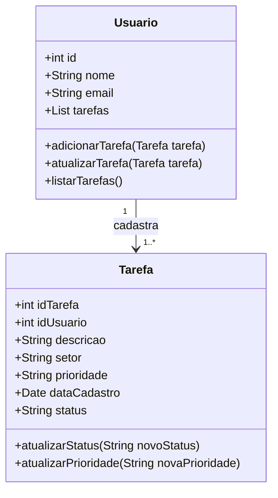
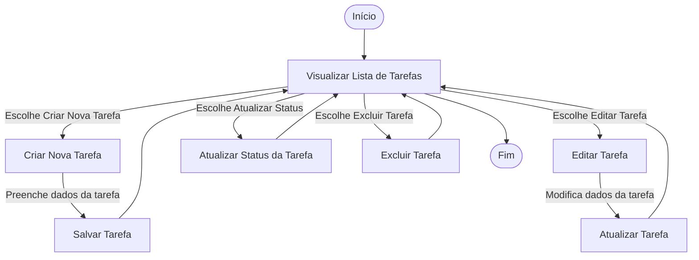

# ATV_Todo-List
  
  Diagrama de Classe

```mermaid

    classDiagram
    class Usuario {
        +int id
        +String nome
        +String email
        +List<Tarefa> tarefas
        +adicionarTarefa(Tarefa tarefa)
        +atualizarTarefa(Tarefa tarefa)
        +listarTarefas()
    }

    class Tarefa {
        +int idTarefa
        +int idUsuario
        +String descricao
        +String setor
        +String prioridade
        +Date dataCadastro
        +String status
        +atualizarStatus(String novoStatus)
        +atualizarPrioridade(String novaPrioridade)
    }

    Usuario "1" --> "1..*" Tarefa : cadastra


```

```mermaid
flowchart TD
    %% Início
    Start([Início]) --> ViewTasks[Visualizar Lista de Tarefas]
    
    %% Fluxo de visualização e criação de tarefas
    ViewTasks -->|Escolhe Criar Nova Tarefa| CreateTask[Criar Nova Tarefa]
    CreateTask -->|Preenche dados da tarefa| SaveTask[Salvar Tarefa]
    SaveTask --> ViewTasks

    %% Fluxo de edição de tarefa
    ViewTasks -->|Escolhe Editar Tarefa| EditTask[Editar Tarefa]
    EditTask -->|Modifica dados da tarefa| UpdateTask[Atualizar Tarefa]
    UpdateTask --> ViewTasks

    %% Fluxo de atualização de status
    ViewTasks -->|Escolhe Atualizar Status| UpdateStatus[Atualizar Status da Tarefa]
    UpdateStatus --> ViewTasks

    %% Fluxo de exclusão de tarefa
    ViewTasks -->|Escolhe Excluir Tarefa| DeleteTask[Excluir Tarefa]
    DeleteTask --> ViewTasks

    %% Fim do fluxo
    ViewTasks --> End([Fim])

```
